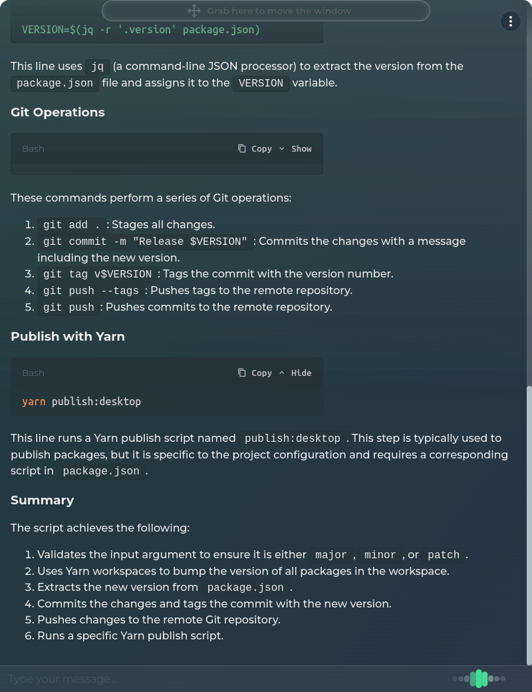

# Aktyn Assistant

[](https://github.com/Aktyn/DesktopVoiceAssistant)
[](https://github.com/Aktyn/DesktopVoiceAssistant/blob/master/LICENSE)
[](https://GitHub.com/Aktyn/DesktopVoiceAssistant/issues/)
[](https://github.com/Aktyn/DesktopVoiceAssistant/stargazers)

---

**Table of content:**
 - [Overview](#overview)
 - [Gallery](#gallery)
 - [Download](#download)
 - [Requirements](#requirements)
 - [Development setup](#development-setup)
 - [Tools](#tools)
 - [Future plans](#future-plans)

---

## Overview <a id="overview"></a>

#### Aktyn Assistant is an application that allows you to interact with an AI on various types of devices while performing regular tasks.  
- Quick chat window can be easily activated with a keyboard shortcut.  
- Users can configure its default behavior by simply describing it in the settings.  
- The assistant can read responses aloud and will soon also be able to understand what the user is saying.  
- Chat can be configured to include history of previous messages for a more continuous conversation.
- A customizable and easy-to-manage system of tools allows users to extend the capabilities of the Assistant.

---

## Gallery! <a id="gallery"></a>
<details>
  <summary>Click here to see some screenshots</summary>

  #### Some views in main window (instructed to respond in a leet speak)
  
  
  

  #### Example quick chat window after asking about given screenshot of code
  
  
</details>

###### (Coming soon) It is able to take a quick glance at your screen and answer questions about it.<br />By utilizing different type of AI models, it can perform different tasks like generating images, making real time conversations, understanding image context, etc.

---

## Download <a id="download"></a>
Go to [releases](https://github.com/Aktyn/aktyn-assistant/releases) page and download the latest version for your platform.  
Additional platforms may be supported upon [request](https://github.com/Aktyn/aktyn-assistant/issues/new).

---

## Requirements <a id="requirements"></a>

- Upon first run, you will be prompted to enter your OpenAI API key.  
  If you already have an OpenAI account, you can generate an API key [here](https://platform.openai.com/account/api-keys).
- Speaking relies primarily on the media players installed on your system.  
  If neither of them is installed, the application will fall back to a less stable solution for playing audio.
  <details>
    <summary>Supported players</summary>

    - mplayer
    - afplay
    - mpg123
    - mpg321
    - play
    - omxplayer
    - aplay
    - cmdmp3
  </details>
  

---

## Development setup <a id="development-setup"></a>

#### Prerequisites

- **`yarn install`** - yarn 4.2.2 or newer is recommended

#### Terminal app

- **`yarn build:all`** and **`yarn start:terminal`** to run the application with terminal interface
- Some console features doesn't work inside turbo which handles the development run.  
  To make sure the console features work while you develop terminal app you can run **`yarn dev:packages`** to watch changes only in _packages/_ and then **`yarn run build && npx cross-env NODE_ENV=dev yarn start`** from _apps/terminal_ directory

#### Desktop app

- **`yarn build:all`** and **`yarn start:desktop`** to run the application with desktop interface
- **`yarn dev:packages`** to watch changes only in _packages/_ and then **`yarn dev:desktop`**

##### Building desktop app for various platforms

- **`yarn build:all`** and **`yarn start:desktop`** will build project binaries and prepare them for distribution (check _apps/desktop/out_ directory afterwards)

##### Publishing desktop app

- **`yarn build:all`** and **`yarn publish:desktop`** to build and publish the application to github releases

---

## Tools <a id="tools"></a>

Assistant can be instructed to call a defined function when needed and use its output to provide an answer based on the data it has received.  
This feature is called [function calling](https://platform.openai.com/docs/guides/function-calling) and is supported by the OpenAI API.
Function calling can also be used as a way for the assistant to interact with the system using code provided by tools.

There are some built-in tools that can be used out of the box, but adding more is as simple as selecting a directory and the main file within it.

A tool can by any NodeJS project that exports a function that returns an array of objects (tools) with compatible structure.
<details>
  <summary>Click here to see example tool file</summary>

  ```javascript
  exports.default = index;
  const toolSchema = {
    version: '1.0.0',
    functionName: 'get_current_weather',
    //Description tells AI what the function does so it can decide whether to call it or not
    description: 'Get the current weather in a given location',
    parameters: {
      type: 'object',
      properties: {
        location: {
          type: 'string',
          description: 'The city and state, e.g. San Francisco, CA',
        },
        unit: { type: 'string', enum: ['celsius', 'fahrenheit'] },
      },
      required: ['location'],
    },
  };

  // This function can call an external APIs for example. Argument is a JSON object with the parameters defined in the schema
  async function getCurrentWeather(data) {
    const { location } = data;
    if (location.toLowerCase().includes('tokyo')) {
      return JSON.stringify({
        location: 'Tokyo',
        temperature: '10',
        unit: 'celsius',
      });
    }
    else if (location.toLowerCase().includes('san francisco')) {
      return JSON.stringify({
          location: 'San Francisco',
          temperature: '72',
          unit: 'fahrenheit',
      });
    }
    else if (location.toLowerCase().includes('paris')) {
      return JSON.stringify({
        location: 'Paris',
        temperature: '22',
        unit: 'fahrenheit',
      });
    }
    else {
      return JSON.stringify({ location, temperature: 'unknown' });
    }
  }
  function index() {
    return [
      {
        schema: toolSchema,
        function: getCurrentWeather,
      },
    ];
  }
  ```
</details>


---

## Future plans <a id="future-plans"></a>

- Speech synthesis and recognition
- Attaching screenshot or selected screen region to active chat with AI
- Real time voice chat utilizing GPT-4o model possibilities
- Support for multiple AI providers
